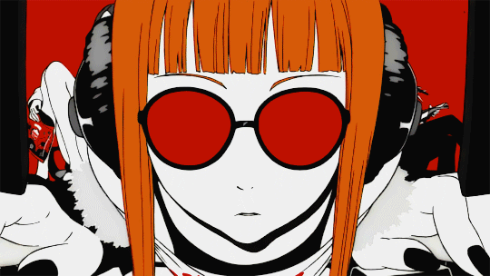

  

## Estudante de Ciências da Computação.

Atualmente estudando Python, C, e Linux.

Meu objetivo a curto prazo é ser bom o suficiente nas ferramentas que uso
ao ponto de conseguir criar (quase) qualquer coisa que eu precise de forma
autônoma.

Meu objetivo a longo prazo é democratizar, aumentar a segurança e privacidade, e ajudar os outros
por meio da tecnologia.

Minhas inspirações e adimirações são:

Ficcional:
- Jiraya (Naruto)
- Lucca (Chrono Trigger)
- 9S (Nier Automata)
- Lain Iwakura

Vida Real:
- Os bons mantedores e apoiadores do FOSS. 
